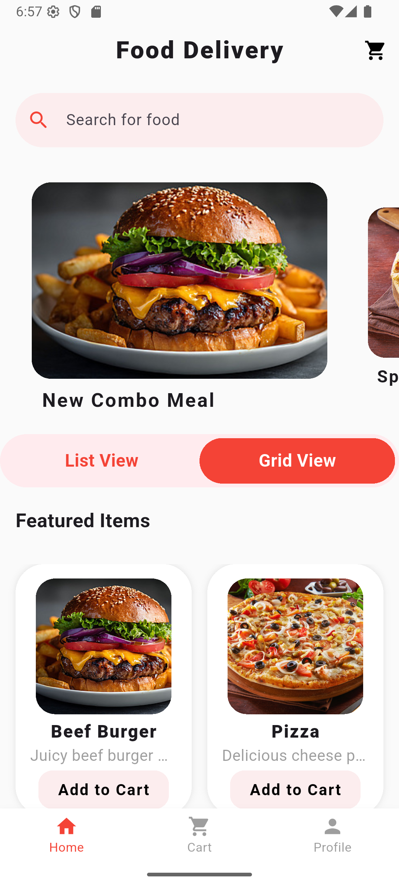
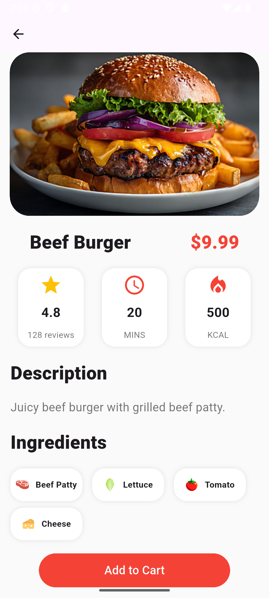
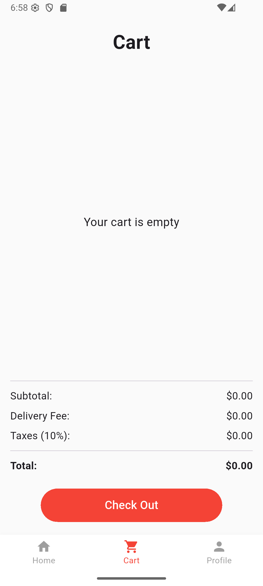
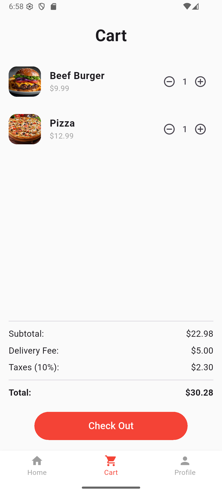

# Food Delivery App 🍔

A simple Flutter-based **Food Delivery App UI** 
---


## 🖼 Screenshots

<p align="center">
  
  
  
  
</p>


---

## ⚙ Installation

1. Make sure you have [Flutter installed](https://flutter.dev/docs/get-started/install).  
2. Clone the repository:

```bash
git clone https://github.com/FAr-Es/food_delivery_app.git
