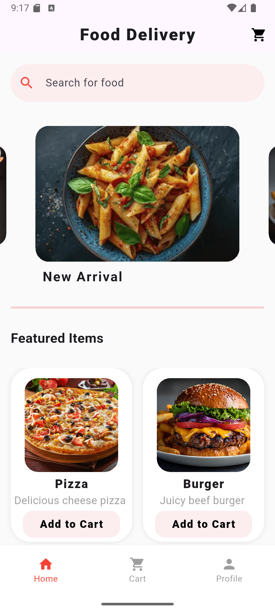

# Food Delivery App 🍔

A Flutter-based **Food Delivery App UI** showcasing modern design patterns like carousels, product grids, and a stylish bottom navigation bar. Perfect for learning UI/UX in Flutter or showcasing your portfolio.

---

## 📱 Features

- **Search Bar** with rounded design
- **Carousel Slider** for promotional banners with captions
- **Gradient / Stylish Divider** separating sections
- **Featured Items Grid** with:
  - Rounded cards
  - Shadows
  - Images, titles, descriptions
  - Add to Cart buttons
- **Custom Bottom Navigation Bar** with:
  - Height control
  - Selected & unselected colors
  - Rounded design
- Fully responsive and mobile-friendly

---

## 🖼 Screenshots




---

## ⚙ Installation

1. Make sure you have [Flutter installed](https://flutter.dev/docs/get-started/install).  
2. Clone the repository:

```bash
git clone https://github.com/your-username/food_delivery_app.git
